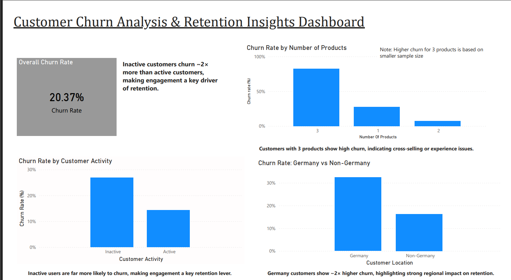

# 📊 Customer Churn Analysis & Prediction

This project analyzes customer churn behavior and builds predictive models to identify high-risk customers, enabling proactive retention strategies and reducing revenue loss.

---

## 🎯 Project Objective

Predict customer churn and identify key factors driving customer attrition to enable proactive retention strategies and reduce revenue loss.

## 📊 Dashboard Preview



👉 [Download Full Dashboard (PDF)](dashboard/churn_dashboard.pdf)
---

## 📁 Project Structure

```
CHURN_ANALYSIS/
│
├── dashboard/
│   ├── churn_dashboard.pbix          # Power BI interactive dashboard
│   └── churn_dashboard.pdf           # Static dashboard export
│
├── data/
│   ├── cleaned_enhanced_customer_data.csv    # Processed dataset with engineered features
│   └── model_performance.csv         # Model evaluation metrics
│
├── notebooks/
│   └── churn_analysis_final.ipynb     # Main analysis notebook
│
└── README.md                         # Project documentation
```

---

## 🔍 Key Findings

### Churn Drivers
- **Activity Status:** Inactive members show **~2x higher churn rate** (27% vs 14%)
- **Age Factor:** Customers aged **45+** exhibit **45% churn rate** (vs 7.5% for young adults)
- **Product Ownership:** Customers with **3-4 products** show **80%+ churn** (warning signal)
- **Geography:** German customers have **32% churn** vs **16%** in other regions
- **Critical Segment:** Older customers (45+) with high balances are highest-risk group

### Business Impact
- Early identification enables proactive retention efforts
- Retention costs **~5x less** than new customer acquisition
- Potential **15–20%** churn reduction through targeted interventions, based on industry benchmarks

---

## 🤖 Models Implemented

| Model | Accuracy | ROC-AUC | Recall | Key Strength |
|-------|----------|---------|--------|--------------|
| **Logistic Regression** | 74% | 0.85 | **77%** | Best recall - catches most churners |
| **Random Forest** | 81% | **0.86** | 70% | Best balance & interpretability |
| **Gradient Boosting** | 82% | 0.85 | 69% | High accuracy |
| **Weighted Ensemble** | 82% | 0.86 | 71% | Combined strengths |
| **Stacking Ensemble** | **85%** | 0.83 | 57% | Highest accuracy, lower recall |

---

## 🏆 Final Model Selection

**Random Forest** selected as the production model:

✅ **Best ROC-AUC (0.86)** - Superior discriminative ability  
✅ **Balanced Recall (70%)** - Catches majority of churners without excessive false positives  
✅ **Interpretable** - Clear feature importance for business stakeholders  
✅ **Stable** - Generalizes well to new data

**Why not Stacking?**  
Despite 85% accuracy, Stacking's 57% recall misses too many churners - unacceptable for a business case where retention is critical.

---

## 📊 Interactive Dashboard

Power BI dashboard featuring:

### Overview Tab
- Churn distribution by activity status
- Geographic analysis
- Product ownership patterns

### Deep Analysis Tab
- Age group segmentation
- Balance distribution analysis
- High-risk customer identification

### Model Performance Tab
- Accuracy vs Recall trade-offs
- ROC-AUC comparison
- Feature importance visualization

📥 **Access:** `dashboard/churn_dashboard.pbix` (interactive) or `dashboard/churn_dashboard.pdf` (static view)

---

## 🔧 Feature Engineering

**11 new features created** to enhance prediction:

- **Age Segments:** `IsYoungAdult`, `IsSenior`
- **Balance Indicators:** `HasZeroBalance`, `HighBalance`
- **Activity Patterns:** `InactiveHighBalance` (risk interaction)
- **Tenure Markers:** `IsNewCustomer`, `IsLoyalCustomer`
- **Credit Categories:** `CreditScore_Category`
- **Ratio Features:** `BalanceToSalary`, `Age_Balance_Interaction`

**Result:** 24 total features (from original 12)

---

## 🛠️ Technologies Used

**Programming & Analysis:**
- Python 3.8+
- Pandas, NumPy (data manipulation)
- Scikit-learn (machine learning)
- Matplotlib, Seaborn (visualization)

**Tools:**
- Jupyter Notebook (analysis environment)
- Power BI (interactive dashboards)

**Techniques:**
- Class imbalance handling (oversampling)
- Feature engineering & selection
- Ensemble methods & stacking
- Hyperparameter tuning

---

## 📈 Results & Recommendations

### Immediate Actions
1. **Engagement Campaign** - Target inactive members with personalized outreach
2. **Age-Specific Retention** - Develop programs for 45+ demographic
3. **Product Portfolio Review** - Investigate why 3-4 product customers churn
4. **Geographic Strategy** - Address German market challenges

### Expected Outcomes
- **15-20% churn reduction** achievable
- **ROI:** Retention is 5x cheaper than acquisition
- **Revenue protection** through early intervention

---

## 📝 How to Use This Project

### 1. Explore the Analysis
```bash
# Open the Jupyter notebook
jupyter notebook notebooks/churn_analysis_final.ipynb
```

### 2. View the Dashboard
- Open `dashboard/churn_dashboard.pbix` in Power BI Desktop
- Or view static PDF: `dashboard/churn_dashboard.pdf`

### 3. Access Processed Data
- Enhanced dataset: `data/cleaned_enhanced_customer_data.csv`
- Model metrics: `data/model_performance.csv`

---

## 🔮 Future Enhancements

- [ ] Deploy model as REST API for real-time scoring
- [ ] A/B test retention strategies on high-risk segments
- [ ] Incorporate customer lifetime value (CLV) analysis
- [ ] Automated retraining pipeline with MLOps
- [ ] Time-series analysis for churn trend forecasting

---

## 👤 Author

**Sukhjeet Singh Kaunsal**

---

## 📄 License

This project is available for educational and portfolio purposes.

---

## 🙏 Acknowledgments

- Dataset: [Kaggle - Bank Customer Churn Dataset](https://www.kaggle.com/)
- Inspiration: Real-world retention challenges in banking industry

---

**⭐ If you found this project helpful, please consider giving it a star!**
